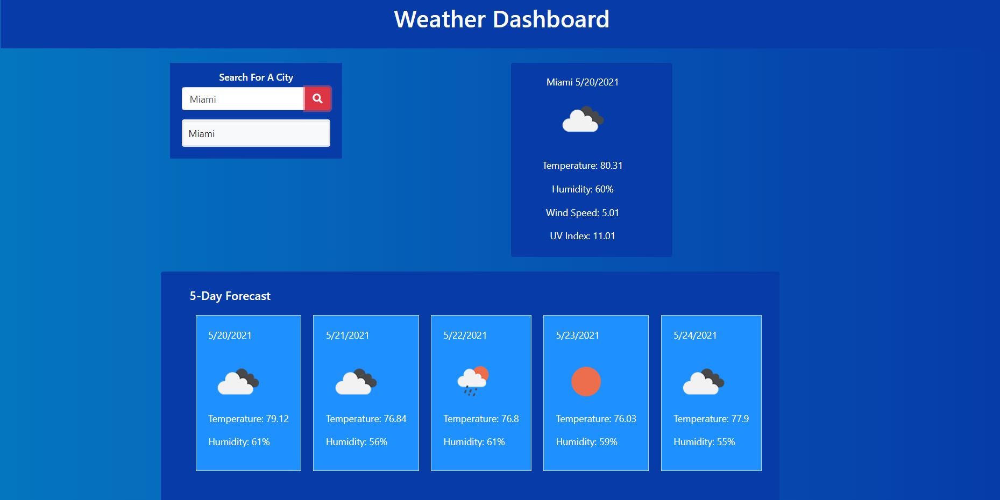

# Weather Dashboard
## by Robert VanScoy
_______________________________________________________________
### Description 
* This website allows users to find the current and five day weather forcast for a city they enter in the Search Box.
  
### License : 

  
* Info on license: https://opensource.org/licenses/MIT
_______________________________________________________________

### Demo:
* Screenshot of deployed site on Github Pages

_______________________________________________________________

_______________________________________________________________

### Installation Instructions:
* Simply clone the repo and run locally.

_______________________________________________________________

### Main Language : 
* javascript

### Contribution Policy: 
* Feel free to email me with program improvement suggestions
_______________________________________________________________
### Test Cases:
* n/a
_______________________________________________________________
### Contact Me 

* https://github.com/vanscoyro
* rvans003@fiu.edu

### TABLE OF CONTENTS 
_______________________________________________________________
* [Description](#description)
* [License](#license-)
* [Demo](#demo)
* [Installation](#installation-instructions)
* [Main Language](#main-language-)
* [Contribution Policy](#contribution-policy)
* [Test Case](#test-cases)
* [Contact Me](#contact-me)

    
  
